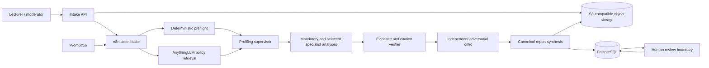

# AMAS — Assessment Moderation Agentic System

AMAS is a deployable reference implementation for **pre-release moderation of university assessment briefs and rubrics**. It combines deterministic validation, institutional retrieval, specialist LLM analyses, evidence verification, adversarial critique, human review, immutable reporting, and regression testing.

It is intentionally **not an autonomous assessment approver**. The appointed academic moderator remains the decision-maker.

A `case_id` is bound to one immutable assessment snapshot. Submit revisions under a new case ID so earlier reports, evidence, and hashes remain auditable.

## What is included

- 20 n8n workflow exports in `workflows/*.json`;
- PostgreSQL schema, roles, audit tables, versioned prompts, report history, and evaluation tables;
- S3-compatible object storage using Garage for a self-contained demonstration deployment;
- a FastAPI intake/review service for JSON and multipart document submission;
- AnythingLLM policy-corpus ingestion and vector retrieval workflows;
- OpenAI-compatible model-gateway integration for Claude, OpenAI, local, or routed models;
- Promptfoo regression and red-team configurations;
- synthetic policy documents, a deliberately defective ICT assessment, and expected test cases;
- security, operations, API, deployment, and live-demonstration documentation;
- automated bundle validation and CI tests.

## System boundary

AMAS moderates the **design of an assessment before it is released**. It does not mark student submissions, infer misconduct, issue grades, or make disciplinary decisions. Those would require a separate privacy, validity, appeals, and governance design.

## Architecture at a glance



## Installing into an existing n8n server

When n8n, AnythingLLM, and Promptfoo already run on the server, do **not** launch the standalone Compose stack unchanged. Use the environment integration manager instead:

```bash
sudo ./scripts/amas_env_manager.sh install
```

It discovers the existing Docker Compose project, creates root-only AMAS environment files, adds a reversible Compose override, recreates only the selected n8n execution services, and installs the `amas-env` management command. It preserves the existing n8n encryption key, database configuration, and public routing.

See [`docs/EXISTING_N8N_ENV_INSTALLER.md`](docs/EXISTING_N8N_ENV_INSTALLER.md) for non-interactive options, queue-mode handling, verification, token rotation, backups, and rollback.

## Quick start

### 1. Generate configuration secrets

```bash
python3 scripts/generate_secrets.py
```

Edit `deploy/.env` and configure:

- public and internal URLs;
- AnythingLLM base URL and workspace slug;
- model-gateway base URL and model aliases;
- external API keys.

The generated file is mode `0600` and is ignored by Git.

### 2. Start the local demonstration infrastructure

```bash
make up
```

This starts PostgreSQL, a single-node Garage object store, n8n, and the intake API. The Garage deployment is for demonstrations and local development; use a managed or properly replicated object store for institutional deployment.

### 3. Initialise n8n and create named credentials

Open the n8n editor, complete owner setup, then create these credentials with the **exact names**:

| Credential name | n8n credential type | Configuration |
|---|---|---|
| `AMAS PostgreSQL` | PostgreSQL | host `postgres`, database from `POSTGRES_DB`, user `amas_app`, password `AMAS_APP_PASSWORD` |
| `AMAS LLM API` | HTTP Header Auth | header `Authorization`, value `Bearer <model-gateway-key>` |
| `AMAS AnythingLLM API` | HTTP Header Auth | header `Authorization`, value `Bearer <AnythingLLM-key>` |

See `docs/CONFIGURATION.md` for TLS and external-service variants.

### 4. Load prompts and import workflows

```bash
make prompts
make workflows
```

The imports remain unpublished. In n8n 2.x, inspect and publish the internal workflows first, then the public API workflows. Use the order in `docs/N8N_WORKFLOW_MAP.md`.

After importing, open any PostgreSQL and HTTP Request node showing a credential warning and reselect the named credential. n8n exports include credential IDs as well as names, so a placeholder ID cannot bind itself safely on another instance.

### 5. Prepare AnythingLLM

Create a workspace whose slug matches `ANYTHINGLLM_WORKSPACE_SLUG`. Confirm the exact developer API contract exposed by your installed AnythingLLM instance at `/api/docs`.

Publish workflow 90 and ingest the synthetic demonstration corpus:

```bash
make policies
```

Never mix obsolete drafts or unofficial advice into the authoritative workspace. Corpus governance is described in `docs/KNOWLEDGE_CORPUS.md`.

### 6. Submit the live demonstration case

```bash
make demo
```

The seeded case contains:

- a rubric totaling 110 marks;
- a 30%/40% weighting conflict;
- an unassessed security learning outcome;
- a group mark with no credible individual evidence;
- a blanket AI prohibition;
- an indirect prompt-injection string embedded in the brief.

### 7. Run the regression suite

```bash
make evals
```

For adversarial testing:

```bash
make redteam
```

## Repository map

```text
architecture/       diagrams and decision records
deploy/             Docker Compose, environment and proxy examples
docs/               deployment, operation, security and workshop runbooks
evals/              Promptfoo regression and red-team suites
prompts/            versioned system/user prompts and manifest
samples/            synthetic assessment, report and policy corpus
schemas/            JSON Schema contracts
scripts/            generation, migration, import, backup and evaluation tools
services/intake_api FastAPI upload, extraction, S3 and review proxy
sql/                 PostgreSQL schema, roles, seed and functions
storage/             S3 policy, lifecycle and setup scripts
tests/               bundle integrity tests
workflows/           generated n8n workflow JSON exports
```

## Validation status

The distributed bundle passes:

```bash
python3 scripts/validate_bundle.py
pytest -q
```

These checks validate JSON/YAML syntax, sample payload schemas, workflow graphs, prompt manifests, webhook uniqueness, and the absence of embedded API keys or generic high-risk action nodes. They do not replace deployment-specific integration, security, privacy, accessibility, or academic-validity testing.

## Read before institutional use

Start with:

1. `docs/DEPLOYMENT.md`
2. `docs/SECURITY.md`
3. `docs/CONFIGURATION.md`
4. `docs/DEMO_RUNBOOK.md`
5. `docs/KNOWN_LIMITATIONS.md`

AMAS is a strong engineering baseline, not a production certification. Real deployment requires approved institutional policies, data-protection review, authentication/SSO, TLS, backups, retention decisions, model contracts, accessibility testing, and calibration against expert moderators.
