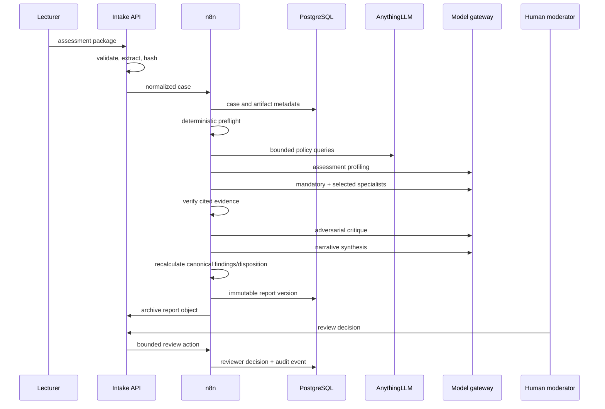

# Architecture

## Design objectives

AMAS is designed around six constraints:

1. **Deterministic rules stay deterministic.** Arithmetic, required fields, dates, document integrity, and explicit identifier checks do not require an LLM.
2. **LLMs receive bounded analytical roles.** Each specialist has a narrow prompt, typed output contract, and no generic action tool.
3. **Institutional claims require retrieved evidence.** Policy findings are rejected when their source identifiers or excerpts cannot be verified.
4. **Uploaded documents are hostile input.** Instructions inside assessment documents or retrieved passages never become system authority.
5. **A second model challenges the first pass.** The critic may uphold, revise, downgrade, or reject findings but cannot approve an assessment.
6. **Human review is the terminal authority.** The system can recommend; the appointed moderator decides.

## Logical components

### Intake API

The FastAPI service:

- accepts validated JSON or multipart files;
- extracts text from PDF, DOCX, plain text, Markdown, HTML, and simple RTF;
- hashes originals and extracted text;
- writes originals to S3-compatible object storage;
- forwards a normalized case payload to n8n;
- proxies report retrieval and review actions;
- archives canonical report JSON as an immutable object.

### n8n orchestration

n8n controls case state, workflow execution, specialist routing, retries, API calls, and handoffs. The root workflow never grants an LLM arbitrary network, SQL, email, filesystem, or publishing access.

### PostgreSQL

PostgreSQL is the canonical state and audit store. It contains:

- cases and artifacts;
- learning outcomes;
- immutable prompt versions;
- policy-source metadata;
- preflight, retrieval, and model runs;
- verified findings;
- versioned canonical reports;
- reviewer actions and audit events;
- evaluation cases and results.

### AnythingLLM

AnythingLLM is used only as the authoritative policy retrieval service. It is not the case store or the system controller. Submitted assessments are not embedded in the shared policy workspace.

### Model gateway

All model calls use an OpenAI-compatible `/chat/completions` contract. A gateway such as LiteLLM can route the stable internal aliases `moderation-primary` and `moderation-critic` to Claude, OpenAI, or approved local models without editing workflows.

### Object storage

Object storage holds original submissions and canonical report JSON. PostgreSQL retains hashes and storage keys. The local Compose profile uses Garage; institutional deployment can replace it with AWS S3, MinIO, Ceph RGW, Azure S3-compatible gateways, or another approved service.

## Moderation sequence

## Agentic versus deterministic behavior

| Function | Implementation |
|---|---|
| Rubric arithmetic | deterministic Code node |
| Required-field and date checks | deterministic Code node |
| Prompt-injection indicators | deterministic pattern checks plus specialist analysis |
| Policy passage retrieval | vector search with bounded query/top-k |
| Outcome alignment interpretation | specialist LLM |
| Rubric quality | specialist LLM |
| Assessment validity | specialist LLM |
| AI-use design | specialist LLM |
| Optional specialist routing | profiling supervisor constrained to an allowlist |
| Citation existence and excerpt support | deterministic verifier |
| Challenge of overclaiming | independent critic LLM |
| Final disposition | deterministic rules after model synthesis |
| Approval | human moderator only |

## Failure behavior

- Missing core documents produces `insufficient_evidence`.
- A critical injection finding produces `blocked_security`.
- An unresolved authoritative conflict produces `policy_conflict_requires_review`.
- A failed optional specialist is represented as an uncertainty rather than silently omitted.
- Object-archive failure is converted to an explicit warning; PostgreSQL remains the canonical report store and automated archive retry/alerting is a deployment concern.
- Report synthesis takes a case-scoped PostgreSQL advisory lock before allocating the next report version.
- A case ID is bound to an immutable canonical input digest; revised assessment packages use a new case ID.
- No high-severity policy finding survives without retrieved policy evidence.

## Scaling path

The reference stack runs n8n in regular single-main mode. At higher load:

- move n8n to queue mode with Redis workers;
- isolate model calls into worker pools;
- use managed PostgreSQL with connection pooling;
- use replicated object storage;
- add distributed tracing and centralized logs;
- place internal webhooks on a private network;
- replace synchronous API completion with asynchronous case status and notifications.
